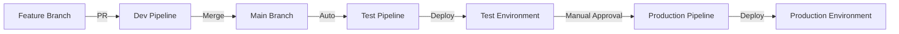

# GitHub Environments Configuration

## Overview
This directory contains environment-specific configurations for the CI/CD pipeline.

## Environments

### 1. Development (dev)
- **Purpose**: Feature development and experimentation
- **Triggers**: Every push to feature branches
- **Tests**: Unit tests, linting, basic checks
- **Deployment**: None (local development only)
- **Risk Level**: None

### 2. Test (staging)
- **Purpose**: Integration testing and QA
- **Triggers**: Merge to main branch
- **Tests**: Full test suite, integration tests, paper trading
- **Deployment**: Automated to test servers
- **Risk Level**: Low (paper trading only)

### 3. Production (prod)
- **Purpose**: Live trading environment
- **Triggers**: Version tags (v*.*.*)
- **Tests**: Full validation, performance benchmarks
- **Deployment**: Manual approval required
- **Risk Level**: HIGH (real money)

## Environment Variables

### Development
```yaml
ENVIRONMENT: dev
TRADING_MODE: simulation
RISK_LIMITS: relaxed
LOG_LEVEL: debug
```

### Test/Staging
```yaml
ENVIRONMENT: test
TRADING_MODE: paper
RISK_LIMITS: standard
LOG_LEVEL: info
MONITORING: enabled
```

### Production
```yaml
ENVIRONMENT: production
TRADING_MODE: live
RISK_LIMITS: strict
LOG_LEVEL: warn
MONITORING: enabled
ALERTING: enabled
PERFORMANCE_MODE: ultra_low_latency
```

## Protection Rules

### Main Branch
- Require pull request reviews (1 minimum)
- Dismiss stale reviews
- Require status checks (tests must pass)
- Require branches to be up to date
- Include administrators

### Production Environment
- Required reviewers: 2
- Wait timer: 30 minutes (market hours check)
- Manual approval only
- Deployment windows: Market closed only

## Secrets Management

### Required Secrets
```yaml
# Trading Credentials (Production only)
ZERODHA_API_KEY: <encrypted>
ZERODHA_API_SECRET: <encrypted>
BINANCE_API_KEY: <encrypted>
BINANCE_API_SECRET: <encrypted>

# Monitoring
SLACK_WEBHOOK: <for alerts>
DATADOG_API_KEY: <for metrics>

# Deployment
SSH_PRIVATE_KEY: <for server access>
PROD_SERVER_IP: <production server>
TEST_SERVER_IP: <test server>
```

## Setting Up Environments

1. **Go to GitHub Settings → Environments**

2. **Create "development" environment**:
   - No protection rules
   - No secrets needed

3. **Create "test" environment**:
   - Protection rules: None
   - Secrets: Test API keys only
   - Auto-deploy from main

4. **Create "production" environment**:
   - Protection rules:
     - Required reviewers: 2
     - Wait timer: 30 minutes
   - Secrets: Production API keys
   - Manual deployment only

5. **Create "production-approval" environment**:
   - Protection rules:
     - Required reviewers: Your GitHub username
   - Used as gate between test and prod

## Deployment Flow



## Rollback Procedure

### Test Environment
```bash
# Automatic rollback on failure
git revert <commit>
git push
# Pipeline auto-deploys previous version
```

### Production Environment
```bash
# Manual rollback required
ssh prod-server
cd /opt/shrivenquant/bin
mv shriven-quant.backup shriven-quant
systemctl restart shrivenquant
```

## Monitoring

### Key Metrics to Watch
- Order latency (must be <100μs)
- Risk check latency (must be <50μs)
- Memory usage (should be constant)
- Error rate (should be 0%)
- Order fill rate

### Alerts
- Latency spike >200μs
- Memory growth >10%
- Any panic or crash
- Risk limit breach
- Connection loss

## Emergency Procedures

### Stop Trading Immediately
```bash
curl -X POST https://shrivenquant.example.com/emergency-stop
```

### Rollback Production
```bash
./scripts/rollback-production.sh <previous-version>
```

### Disable Auto-Deploy
Go to GitHub Actions → Disable workflow

## Compliance Notes

1. All production deployments must be:
   - Logged with timestamp
   - Approved by 2 people
   - Tested in paper mode first
   - Deployed outside market hours

2. Audit trail maintained for:
   - Who deployed
   - What version
   - When deployed
   - Test results

3. Required documentation:
   - Release notes
   - Performance benchmarks
   - Risk assessment
   - Rollback plan