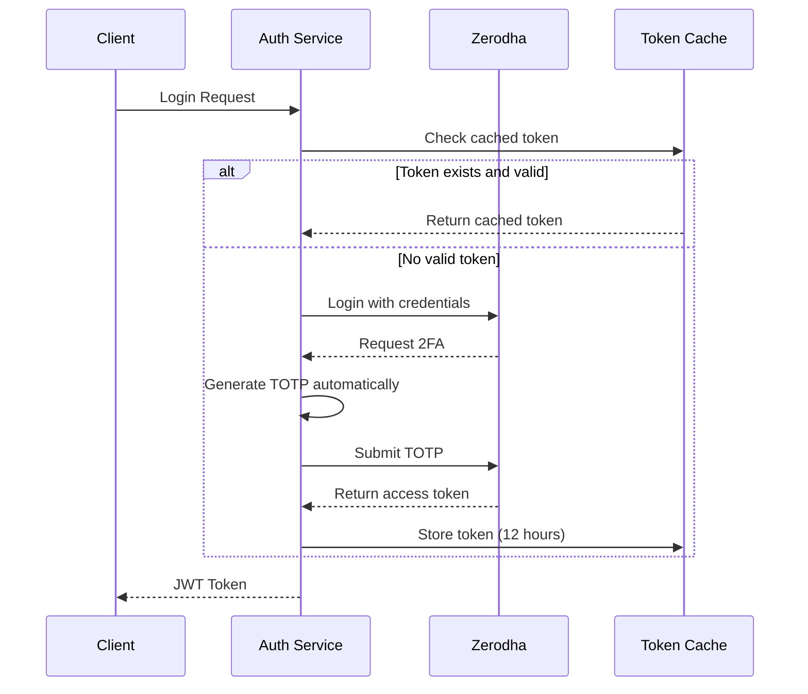

# Zerodha Integration Guide

**Complete guide for integrating Zerodha KiteConnect with ShrivenQuant**

**Platform Status**: [View Current Status](PLATFORM_STATUS_REPORT.md) | **Architecture**: [System Overview](architecture/CURRENT_ARCHITECTURE.md)

---

## Current Implementation Status

### ✅ **What's Working (Production-Ready)**
- **Auth Service**: Full gRPC server with automated TOTP (8,305 lines)
- **API Gateway**: REST endpoints with Zerodha integration via gRPC
- **Session Management**: 12-hour token caching with automatic refresh
- **Multi-Exchange**: Unified auth supporting Zerodha + Binance

### 🔧 **What's Planned** 
- **Market Connector**: Real-time market data (business logic complete, need gRPC server)
- **Execution Router**: Order management (algorithms ready, need service implementation)

---

## Table of Contents
1. [Architecture Overview](#architecture-overview)
2. [Prerequisites](#prerequisites)
3. [Setup Instructions](#setup-instructions)
4. [Authentication Flow](#authentication-flow)
5. [API Usage](#api-usage)
6. [Testing](#testing)
7. [Troubleshooting](#troubleshooting)
8. [Security Best Practices](#security-best-practices)

## Architecture Overview

### **Current Service Architecture**
```
External Client → API Gateway → Auth Service → Zerodha API
     (REST)         (REST)        (gRPC)        (HTTP)
```

**What this means**:
- ✅ **API Gateway** (port 8080): Your applications connect here via REST
- ✅ **Auth Service** (port 50051): Handles all Zerodha authentication via gRPC
- ✅ **Unified Interface**: One authentication service for all exchanges

ShrivenQuant provides **production-ready automated Zerodha authentication** with zero manual intervention. The integration handles:

- ✅ Automatic TOTP generation for 2FA
- ✅ Session caching (12-hour validity)
- ✅ Automatic token refresh
- ✅ Multi-exchange support (Zerodha + Binance)
- ✅ gRPC-based service architecture
- 🔧 Real-time market data streaming (planned - business logic complete)

## Prerequisites

### 1. Zerodha Account Requirements
- Active Zerodha trading account
- KiteConnect API subscription
- 2FA enabled (TOTP-based)

### 2. KiteConnect App Setup
1. Go to https://kite.trade/
2. Create a new app
3. Note down:
   - API Key
   - API Secret
4. Set redirect URL to: `http://127.0.0.1`

### 3. TOTP Secret Extraction
To get your TOTP secret for automation:

1. When setting up 2FA in Zerodha, you'll see a QR code
2. Click "Can't scan? Enter manually"
3. Copy the secret key shown (32 characters, uppercase)
4. This is your `ZERODHA_TOTP_SECRET`

## Setup Instructions

### Step 1: Configure Credentials

Create a `.env` file in the project root:

```bash
# Zerodha KiteConnect Credentials
ZERODHA_USER_ID=YOUR_TRADING_ID        # e.g., AB1234
ZERODHA_PASSWORD=YOUR_PASSWORD         # Your Kite password
ZERODHA_TOTP_SECRET=YOUR_TOTP_SECRET   # 32-char secret from 2FA setup
ZERODHA_API_KEY=YOUR_API_KEY           # From KiteConnect app
ZERODHA_API_SECRET=YOUR_API_SECRET     # From KiteConnect app

# Optional: Custom cache directory
SHRIVEN_CACHE_DIR=./cache/zerodha

# JWT Configuration (for gRPC)
JWT_SECRET=your-secret-key-change-in-production
TOKEN_EXPIRY=3600
```

### Step 2: Test Authentication

Run the simple authentication test:

```bash
cargo run -p auth-service --example zerodha_simple_usage
```

Expected output:
```
✅ Authenticated! Token: maMUm1U89IvbfiwP9vMi...
User: AB1234
Email: your.email@gmail.com
Available margin: ₹10000.00
```

### Step 3: Start Auth Service

```bash
# Start the auth service with Zerodha integration
cargo run -p auth-service

# Output:
# INFO auth_service: Starting ShrivenQuant Auth Service
# INFO auth_service::zerodha_service: Using Zerodha authentication service
# INFO auth_service: Starting gRPC server on 0.0.0.0:50051
```

## Authentication Flow

### How It Works



### Code Example

```rust
use auth_service::providers::zerodha::{ZerodhaAuth, ZerodhaConfig};

#[tokio::main]
async fn main() -> Result<()> {
    // Load config from .env
    let config = ZerodhaConfig::from_env_file()?;
    
    // Create auth handler
    let auth = ZerodhaAuth::new(config);
    
    // Authenticate (automatic TOTP handling)
    let token = auth.authenticate().await?;
    println!("Token: {}", token);
    
    // Use token for API calls
    let profile = auth.get_profile().await?;
    println!("User: {}", profile.user_id);
    
    Ok(())
}
```

## API Usage

### 1. Using gRPC Client

```rust
use shrivenquant_proto::auth::v1::{
    auth_service_client::AuthServiceClient,
    LoginRequest,
};

// Connect to auth service
let mut client = AuthServiceClient::connect("http://localhost:50051").await?;

// Login with Zerodha
let request = LoginRequest {
    username: "your_api_key".to_string(),
    password: "ignored".to_string(),  // Not used for Zerodha
    exchange: "zerodha".to_string(),
};

let response = client.login(request).await?;
let jwt_token = response.into_inner().token;
```

### 2. Market Data Streaming

```rust
// Use the token for WebSocket connection
let ws_url = format!(
    "wss://ws.kite.trade?api_key={}&access_token={}",
    api_key, access_token
);

// Subscribe to instruments
let subscribe_msg = json!({
    "a": "subscribe",
    "v": [256265, 260105]  // NIFTY, BANKNIFTY token numbers
});
```

### 3. Order Placement

```rust
// Place an order using the authenticated token
let order = json!({
    "tradingsymbol": "INFY",
    "exchange": "NSE",
    "transaction_type": "BUY",
    "order_type": "LIMIT",
    "quantity": 1,
    "price": 1500.0,
    "product": "CNC",
    "validity": "DAY"
});

// POST to https://api.kite.trade/orders/regular
// Header: Authorization: token api_key:access_token
```

## Testing

### Unit Tests
```bash
# Run all auth tests
cargo test -p auth-service

# Run Zerodha-specific tests
cargo test -p auth-service zerodha
```

### Integration Tests
```bash
# Run with real credentials (requires .env)
cargo test -p auth-service test_zerodha_automated_login -- --ignored --nocapture
```

### Performance Tests
```bash
# Benchmark authentication
cargo bench -p auth-service
```

### Manual Testing
```bash
# Interactive demo
cargo run -p auth-service --example zerodha_auto_login_demo

# gRPC client test
cargo run -p auth-service --example grpc_client_test
```

## Troubleshooting

### Common Issues

#### 1. TOTP Code Invalid
**Error:** `TOTP verification failed`

**Solution:**
- Ensure system time is synchronized (use NTP)
- Verify TOTP secret is correct (32 chars, uppercase)
- Check if secret has spaces (remove them)

#### 2. Session Expired
**Error:** `Token has expired`

**Solution:**
- Tokens are valid for ~12 hours
- The system auto-refreshes on next request
- Clear cache if persistent issues: `rm -rf ./cache/zerodha/`

#### 3. Rate Limiting
**Error:** `Too many requests`

**Solution:**
- Zerodha limits: 3 requests/second, 180/minute
- Use cached tokens whenever possible
- Implement exponential backoff

#### 4. Network Issues
**Error:** `Connection refused`

**Solution:**
```bash
# Check if auth service is running
nc -zv localhost 50051

# Check Zerodha API status
curl -I https://api.kite.trade/
```

### Debug Mode

Enable detailed logging:
```bash
RUST_LOG=debug cargo run -p auth-service
```

Check cached tokens:
```bash
cat ./cache/zerodha/zerodha_token_*.json | jq .
```

## Security Best Practices

### 1. Credential Storage
- **Never** commit `.env` file to git
- Use environment variables in production
- Consider using secret management tools (Vault, AWS Secrets Manager)

### 2. Token Management
- Tokens are cached locally with file permissions 600
- Clear cache on logout: `auth.invalidate_cache().await`
- Rotate JWT secrets regularly

### 3. Network Security
- Use TLS for all API calls
- Implement IP whitelisting for production
- Enable Zerodha's IP restriction feature

### 4. Audit Logging
```rust
// Log all authentication attempts
tracing::info!(
    user_id = %user_id,
    timestamp = %chrono::Utc::now(),
    "Authentication attempt"
);
```

### 5. Error Handling
- Never log passwords or secrets
- Sanitize error messages for users
- Use generic errors for auth failures

## Production Deployment

### Environment Variables
```bash
# Production setup
export ZERODHA_USER_ID=$(vault kv get -field=user_id secret/zerodha)
export ZERODHA_PASSWORD=$(vault kv get -field=password secret/zerodha)
export ZERODHA_TOTP_SECRET=$(vault kv get -field=totp secret/zerodha)
export ZERODHA_API_KEY=$(vault kv get -field=api_key secret/zerodha)
export ZERODHA_API_SECRET=$(vault kv get -field=api_secret secret/zerodha)
```

### Docker Deployment
```dockerfile
FROM rust:1.75 as builder
WORKDIR /app
COPY . .
RUN cargo build --release -p auth-service

FROM debian:bookworm-slim
COPY --from=builder /app/target/release/auth-service /usr/local/bin/
ENV RUST_LOG=info
EXPOSE 50051
CMD ["auth-service"]
```

### Kubernetes Secret
```yaml
apiVersion: v1
kind: Secret
metadata:
  name: zerodha-credentials
type: Opaque
stringData:
  ZERODHA_USER_ID: "YOUR_USER_ID"
  ZERODHA_PASSWORD: "YOUR_PASSWORD"
  ZERODHA_TOTP_SECRET: "YOUR_TOTP_SECRET"
  ZERODHA_API_KEY: "YOUR_API_KEY"
  ZERODHA_API_SECRET: "YOUR_API_SECRET"
```

## API Rate Limits

Be aware of Zerodha's rate limits:

| Endpoint | Limit | Window |
|----------|-------|--------|
| Order placement | 10 | per second |
| Order modification | 25 | per second |
| Market data | 1 | per second |
| Historical data | 3 | per second |
| Overall API | 180 | per minute |

## Support & Resources

### Official Documentation
- [Zerodha KiteConnect API](https://kite.trade/docs/connect/v3/)
- [ShrivenQuant Auth Service](./services/auth/README.md)

### Community
- GitHub Issues: https://github.com/praveen686/shrivenquant/issues
- Email: praveenkumar.avln@gmail.com

### Useful Commands
```bash
# Check auth service health
curl http://localhost:50051/health

# View service logs
journalctl -u shrivenquant-auth -f

# Clear token cache
rm -rf ./cache/zerodha/*.json

# Test TOTP generation
cargo run -p auth-service --example test_totp
```

## License Note

Using Zerodha KiteConnect API requires:
1. Active subscription (₹2000/month as of 2024)
2. Compliance with Zerodha's terms of service
3. Proper risk disclosures for end users

---

**Last Updated:** August 13, 2025  
**Maintained by:** ShrivenQuant Team