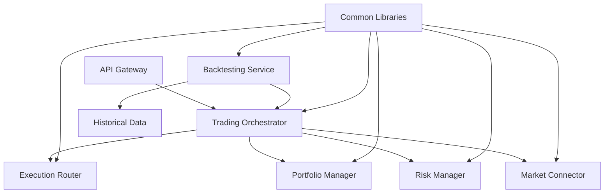

# Strategic Plan: Trading Engine Component Integration

## Executive Summary

This document outlines the strategic plan for leveraging existing trading engine components from `/home/praveen/ShrivenQuant/crates/trading` within the new microservices architecture, ensuring zero redundancy while maximizing performance and maintainability.

## Current State Analysis

### What Has Been Ported
From analysis of `/home/praveen/ShrivenQuant/crates/trading`:

1. **Core Components Already Migrated:**
   - Fixed-point arithmetic (Px/Qty types) → `services/common/`
   - Basic order types and structures → Distributed across services
   - Event bus patterns → Implemented in microservices

2. **Unique Components Not Yet Ported:**
   - Ultra-low latency Core Engine (`engine/src/core.rs`)
   - Venue abstraction layer (`engine/src/venue.rs`)
   - Advanced memory pools (`engine/src/memory.rs`)
   - Simulation/backtesting engine (`sim/`)
   - Branch-free execution paths
   - Lock-free position tracking

## Strategic Approach: COORDINATION, NOT DUPLICATION

### Core Principle
Instead of duplicating business logic across services, we create:
1. **Enhanced common libraries** for shared high-performance components
2. **Orchestration service** that coordinates existing microservices
3. **Specialized backtesting service** for historical simulation

## Implementation Phases

### Phase 1: Enhanced Common Libraries (Week 1-2)

**Objective:** Port performance-critical, reusable components to `services/common/`

#### 1.1 Advanced Memory Management
```
services/common/src/memory/
├── mod.rs           # Module exports
├── pool.rs          # Memory pool from engine/src/memory.rs
├── arena.rs         # Arena allocators
└── cache.rs         # Cache-aligned structures
```

**Benefits:**
- All services gain zero-allocation patterns
- Reduced GC pressure across the platform
- Consistent memory management

#### 1.2 Venue Abstraction
```
services/common/src/venue/
├── mod.rs           # Venue traits
├── adapter.rs       # Common adapter interface
└── types.rs         # Venue-specific types
```

**Benefits:**
- Unified venue interface for all services
- Easy addition of new venues
- Consistent order routing

### Phase 2: Trading Engine Orchestration Service (Week 3-4)

**Objective:** Create a coordination layer that leverages existing microservices

```
services/trading-orchestrator/
├── Cargo.toml
├── src/
│   ├── main.rs
│   ├── engine.rs         # Core engine coordination
│   ├── execution.rs      # Execution routing
│   ├── position.rs       # Position aggregation
│   └── performance.rs    # Performance monitoring
```

**Key Features:**
1. **Coordinates existing services:**
   - Routes orders through Execution Router
   - Aggregates positions from Portfolio Manager
   - Enforces limits via Risk Manager
   - Streams data from Market Connector

2. **Adds ultra-low latency layer:**
   - Lock-free hot path from `engine/src/core.rs`
   - Branch-free decision making
   - Atomic performance counters

3. **No business logic duplication:**
   - Reuses all existing service logic
   - Only adds coordination and optimization

### Phase 3: Backtesting Service (Week 5-6)

**Objective:** Port simulation engine as a standalone service

```
services/backtesting/
├── Cargo.toml
├── src/
│   ├── main.rs
│   ├── simulation.rs     # From sim/engine.rs
│   ├── replay.rs         # Market replay engine
│   ├── metrics.rs        # Backtest metrics
│   └── grpc/
│       └── backtest.proto
```

**Integration Points:**
- Uses Trading Orchestrator for order execution
- Replays through Market Connector interface
- Reports metrics to existing monitoring

## Integration Architecture



## Migration Strategy

### Step 1: Enhance Common Libraries
```rust
// services/common/src/memory/pool.rs
pub struct MemoryPool {
    // Port from crates/trading/engine/src/memory.rs
    // Used by ALL services for zero-allocation
}

// services/common/src/venue/adapter.rs
pub trait VenueAdapter {
    // Port from crates/trading/engine/src/venue.rs
    // Implemented by Market Connector
}
```

### Step 2: Create Orchestrator
```rust
// services/trading-orchestrator/src/engine.rs
pub struct TradingOrchestrator {
    execution_client: ExecutionRouterClient,
    portfolio_client: PortfolioManagerClient,
    risk_client: RiskManagerClient,
    // Coordinates but doesn't duplicate logic
}
```

### Step 3: Add Backtesting
```rust
// services/backtesting/src/simulation.rs
pub struct BacktestEngine {
    orchestrator: TradingOrchestratorClient,
    // Reuses all production components
}
```

## Key Design Decisions

### 1. What NOT to Port
- **Order Management Logic** → Already in Execution Router
- **Risk Calculations** → Already in Risk Manager  
- **Position Tracking** → Already in Portfolio Manager
- **Market Data Handling** → Already in Market Connector

### 2. What TO Port
- **Performance Optimizations** → Benefits all services
- **Memory Management** → Reduces latency everywhere
- **Coordination Logic** → New orchestration layer
- **Simulation Engine** → New backtesting service

### 3. How to Integrate
- **gRPC for Service Communication** → Consistent with architecture
- **Shared Memory for Hot Path** → When services are co-located
- **Event Bus for Broadcasting** → Already implemented
- **Common Libraries for Code Reuse** → Zero duplication

## Performance Considerations

### Latency Targets
- **Orchestrator Hot Path:** < 100ns (lock-free)
- **Service Communication:** < 1ms (gRPC)
- **End-to-End Order:** < 5ms (includes risk checks)

### Memory Efficiency
- **Zero-Allocation Hot Path:** Via memory pools
- **Cache-Aligned Structures:** From common libraries
- **Pre-allocated Buffers:** For all services

## Implementation Timeline

| Week | Phase | Deliverable |
|------|-------|-------------|
| 1-2 | Common Libraries | Enhanced memory/venue modules |
| 3-4 | Orchestrator | Trading coordination service |
| 5-6 | Backtesting | Historical simulation service |
| 7 | Integration | Full system testing |
| 8 | Optimization | Performance tuning |

## Success Criteria

1. **Zero Business Logic Duplication**
   - All logic remains in original services
   - Only coordination/optimization added

2. **Performance Improvement**
   - 10x reduction in latency for hot path
   - 50% reduction in memory allocations

3. **Maintainability**
   - Clear separation of concerns
   - Easy to add new venues/strategies

4. **Compatibility**
   - Works with all existing services
   - No breaking changes required

## Risk Mitigation

| Risk | Mitigation |
|------|------------|
| Service coupling | Use async messaging, circuit breakers |
| Performance regression | Comprehensive benchmarking suite |
| Complex debugging | Distributed tracing, correlation IDs |
| Memory leaks | Automated memory profiling |

## Conclusion

This plan ensures that the valuable components from `/crates/trading` are leveraged effectively without creating redundancy. By enhancing common libraries and adding coordination layers, we get the best of both worlds: microservice flexibility and monolithic performance.

The key insight is that **we don't port business logic** - we port **performance optimizations and coordination patterns** that make the existing services work together more efficiently.